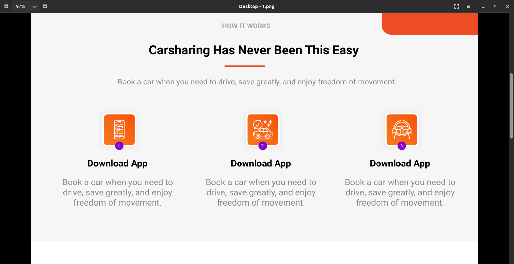
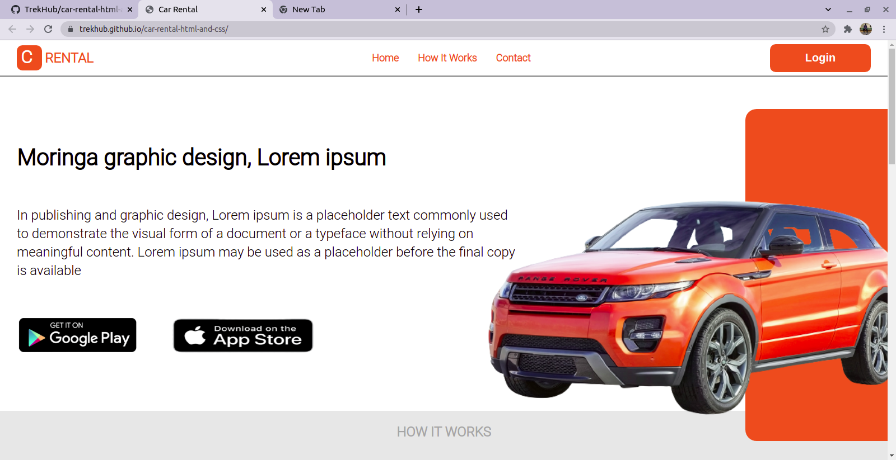

<div style="text-align: center; ">
        <div>
            <h1>Hi There, I'm <span style="color: green; ">Teddy Omondi</span> <span style='font-size:50px;'> &#128075</span></h1>
            <h3>Upcoming Junior Software Developer &#128187; &#127911;</h3>
        </div>
        
</div>
<br>

# Car Rental <span style='font-size:30px;'>&#127828;</span> 

This is a  landing page for a car renting platform

<br>

# The Design <span style='font-size:30px;'>&#128293;</span>

<br>



<br>

# Demo &#128273;

Here is a live link to the project 


https://trekhub.github.io/car-rental-html-and-css/



# Usage

If you want to view the code or change some elements on the website, you are welcomed to clone the project

```git
git clone git@github.com:TrekHub/car-rental-html-and-css.git

```

<h2>Technology Used &#128187; </h2>

1. Html

2. CSS


# Author <span style='font-size:20px;'>&#128524;</span> 

Teddy Omondi 

# License
[MIT](https://choosealicense.com/licenses/mit/)
